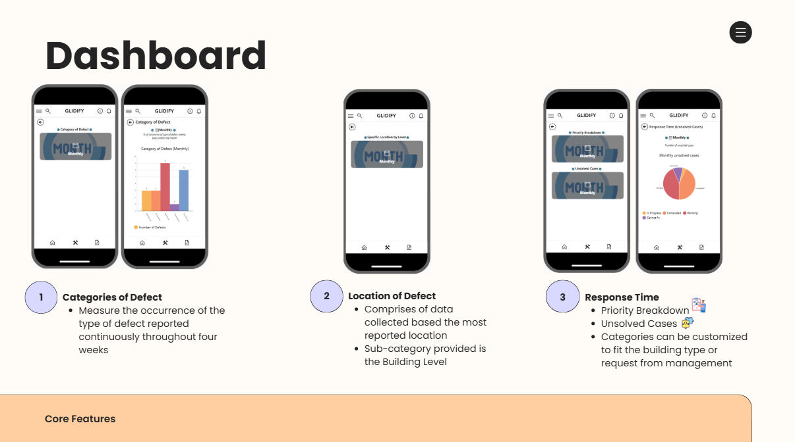
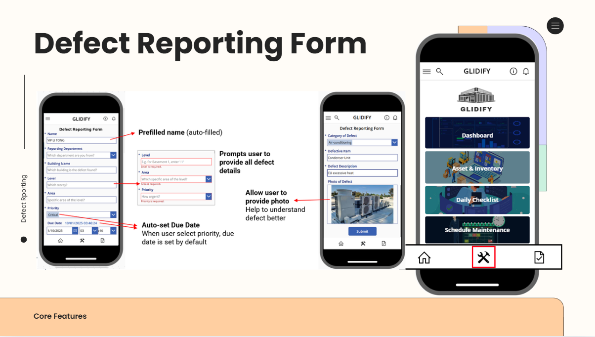
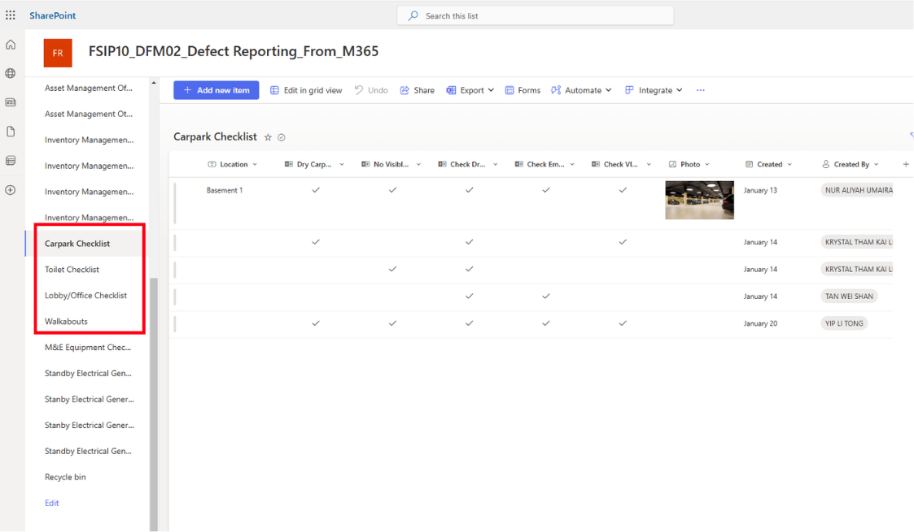

# Digital Maintenance Request System
<p align="center">
  
</p>

## Project Overview
Digital workflow solution designed to streamline maintenance request reporting and improve operational efficiency.

## Business Problem
Property and facilities teams relied on manual reporting methods, resulting in delayed issue resolution, limited visibility into maintenance requests, and inefficient communication between stakeholders. To address these challenges, a digital maintenance request system was developed using Miscrosoft Power Apps to centralise defect reporting and streamline maintenance workflows. 

## Business Value 
The solution demonstrates how digital transformation can improve operational efficiency within facilities management by reducing manual processes and increasing visibility across maintenance workflows. 

## Proposed Solution
A digital maintenance request application was designed to centralise maintenance reporting, improve workflow visibility, and enhance operational coordination.

## Real-world Context 
This project was inspired by common facilities management challenges such as defect reporting, maintenance tracking, and stakeholder coordination.

The concepts developed in this project align closely with real-world facilities operations and property management workflows, specifically in collaboration with Property Facility Services Private Limited (PFS).

## Solution Architecture 
```text
User
  │
  ▼
Power Apps
  │
  ▼
SharePoint
  │
  ▼
Power BI Dashboard
  │
  ▼
Operations Team
```

### Architecture Explanation
The application was built using Microsoft Power Apps as the front-end interface, with SharePoint serving as the central data repository for maintenance requests and status updates. Power BI was utilised to provide visibility into maintenance performance and request tracking.

## Key Features
- Defect reporting submission
- Maintenance request tracking
- User-friendly dashboard
- Workflow status updates
- technican coordination

## UI Screens 
### Dashboard 
<p align="center">
  
</p>

### Request Submission form 
<p align="center">
  
</p>

### Request Tracking 
<p align="center">
  
</p>

## Tools & Technologies
- Microsoft Power Apps
- Microsoft 365
- SharePoint
- Power BI
- Canva

## Documentation
- [Final Project Report](digital-maintenance-request-system/reports/final-report.pdf)
- [Company User Guidelines](digital-maintenance-request-system/user-guidelines/company_user-guidelines.pdf)
- [School User Guidelines](digital-maintenance-request-system/user-guidelines/school_user-guidelines.pdf)
- [Presentation Deck](digital-maintenance-request-system/presentation/FSIP.pdf)

## My Contributions
- Conducted workflow analysis to identify inefficiencies in the existing defect reporting process
- Designed the end-to-end maintenance request workflow and user experience
- Developed application functionalities using Microsoft Power Apps and SharePoint integration
- Collaborated with team members on system planning, testing, and final presentation delivery
- Produced user documentation and business requirement specifications

## Project Impact  
- Improved visibility of maintenance requests 
- Reduced manual coordination effort
- Reduced manual reporting efforts
- Streamlined communication between users and operations team
<p align="center">
  
</p>

## Challenges Encountered 
- Balancing user simplicity with operational requirements
- Designing an efficient workflow for multiple stakeholders
- Ensuring data visibility while maintaining usability

## Key Learning Outcomes
This project strengthened my understanding of:
- digital transformation
- workflow optimisation and mapping
- operational process improvement within facilities management operations.

## Future Improvements 
- AI-powered chatbot to assist users with common maintenance enquiries
- Integrated safety checklist for maintenance personnel
- One-click call function to contact assigned technicians
- Multi-language support to improve accessibility
- Offline reporting capability for areas with poor connectivity
