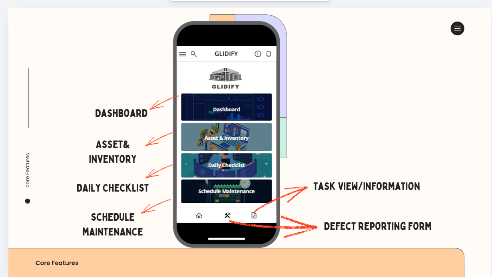
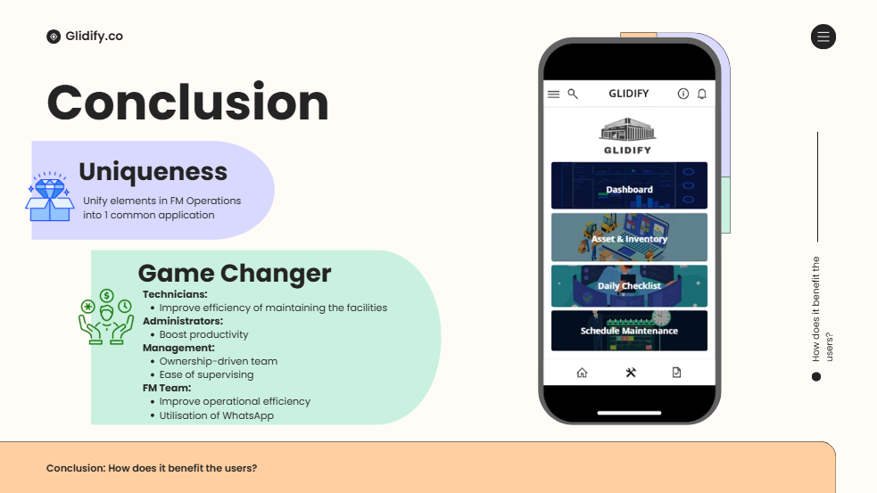

# Digital Maintenance Request System

## Project Overview
Digital workflow solution designed to streamline maintenance request reporting and improve operational efficiency.

## Business Problem
Traditional maintenance reporting processes were inefficient due to fragmented communication, delayed updates, and manual tracking methods.

## Proposed Solution
A digital maintenance request application was designed to centralise maintenance reporting, improve workflow visibility, and enhance operational coordination.

## Workflow diagram 

## Key Features
- Defect reporting submission
- Maintenance request tracking
- User-friendly dashboard
- Workflow status updates
- technican coordination

## UI Screens 

## Documentation
- Final Project Report
- Company User Guidelines
- School User Guidelines
- Presentation Deck

## Tools Used
- Microsoft Power Apps
- Microsoft 365
- Canva
- Power BI
- Sharepoint system 

## My Contributions
- Analysed operational workflow issues
- Designed workflow process and oversee application
- System planning, coding and co-presentator
- Documented business requirements

## Impact 
- Improved visibility of maintenance requests 
- Reduced manual coordination effort
- Streamlined communication between users and operations team

## Key Learning Outcomes
This project strengthened my understanding of:
- digital transformation
- workflow optimisation and mapping
- operational process improvement within facilities management operations.

## Future Improvements 
- AI Chatbot (analysis)
- Safety checklist
- Dial call function
- language features
- offline service 
